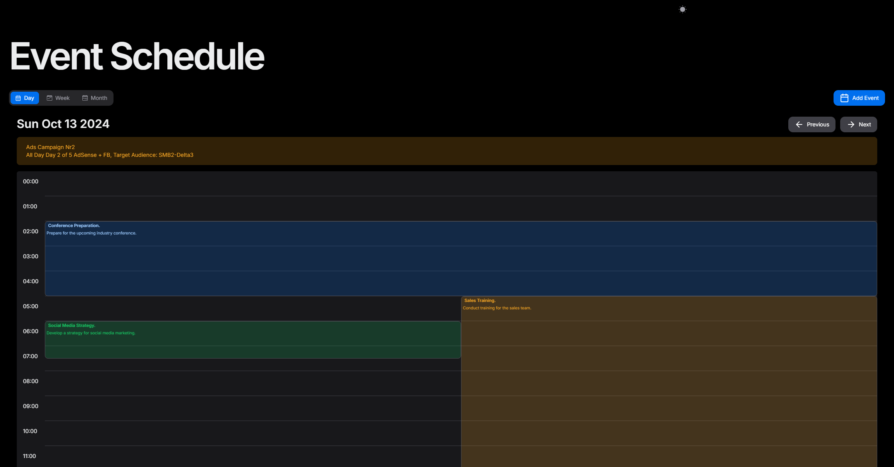
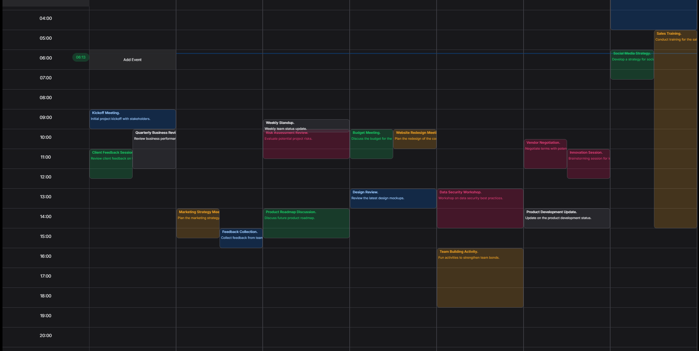
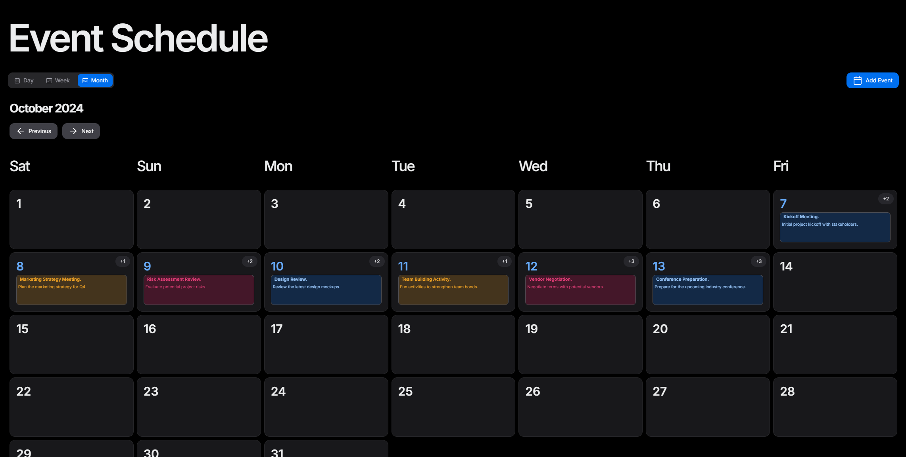
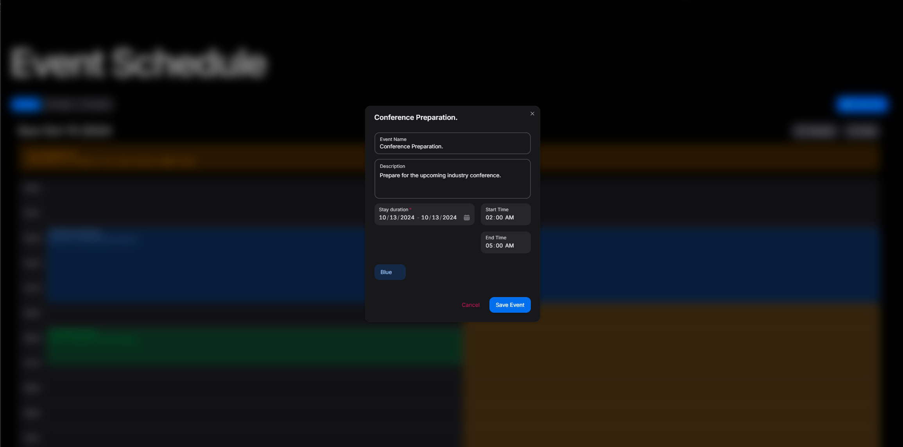
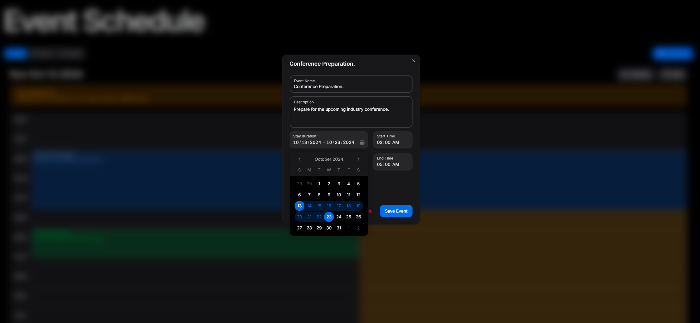
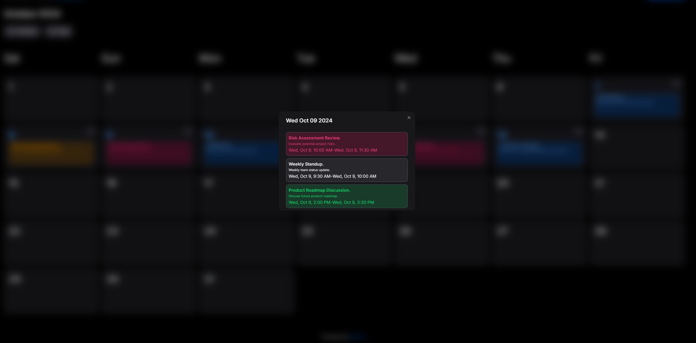
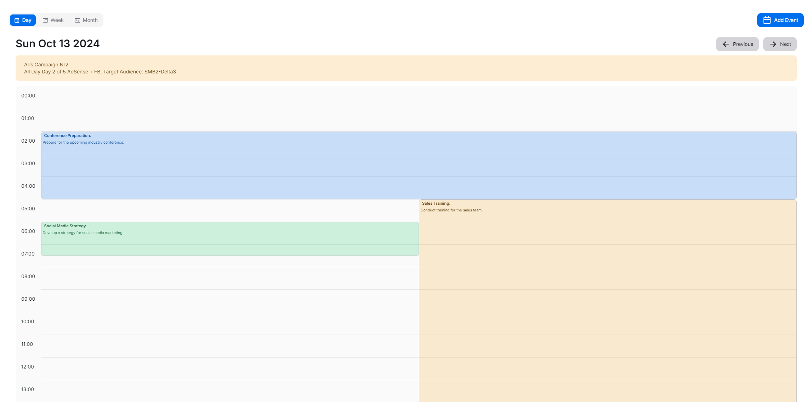

# Mina Scheduler Library

Welcome to the **Mina Scheduler Library**, a customizable and flexible calendar component for React that allows you to manage and display events in day, week, or month views. This library uses **Next UI** components for its user interface, so to ensure a consistent UI experience, make sure to use it inside a **Next UI** project.

## Features

- **Day, Week, Month Views:** Switch between different calendar views with ease.
- **Event Management:** Add, update, and delete events with built-in form validation.
- **Customizable UI:** Easily customize the look and feel of the calendar, including buttons, tabs, and event modals.
- **Mobile-Friendly:** Responsive design optimized for mobile devices.
- **Framer Motion Animations:** Smooth transitions between views.
- **Zod Validation:** Schema validation for ensuring valid event data.
- **Next UI Integration:** Leverages Next UI for a seamless user interface.


## Demo
### Live Demo : https://mina-scheduler.vercel.app/










## Installation

To install the library, run:

```bash
npm install mina-scheduler
```

## Github Repo
https://github.com/Mina-Massoud/next-ui-full-calendar

### Note:
Since this library is built using **Next UI** components, it's recommended to use it within a **Next UI** project to maintain the same UI experience.

### Pre-Styled
To include the styles from the `mina-scheduler` package in your Tailwind CSS setup, add the following line to the `content` array in your `tailwind.config.js`:

```javascript
content: [
    "./node_modules/mina-scheduler/**/*.{js,ts,jsx,tsx}",
    // other paths...
],
```
This line ensures that Tailwind scans all JavaScript and TypeScript files in the `mina-scheduler` package for class names. Make sure to include any other relevant paths in the `content` array as needed.

## Basic Usage

Here’s how you can get started using the **SchedulerProvider** and **SchedularView** components in your React project with minimal setup:

```tsx
"use client";

import { SchedulerProvider, SchedularView } from "mina-scheduler";


export default function Home() {
  return (
    <section className="flex w-full flex-col items-center justify-center gap-4 py-8 md:py-10">
      <SchedulerProvider>
        <SchedularView />
      </SchedulerProvider>
    </section>
  );
}
```

## Setting Initial Events in the Scheduler Component

The `SchedulerProvider` and `useScheduler` hook allow you to manage and set initial events in the scheduler. Here’s a guide to set up initial events and integrate them into your scheduling component.

#### Step 1: Import Required Components and Types

Ensure you Event types and your necessary modules:

```typescript
"use client";

import { Event } from "@/dist";

```

#### Step 2: Define Initial Event Data

To simulate initial events, create an array of events, each structured as an `Event` type. In this example, `endDate` is set to one hour after `startDate`.

```typescript
const events = [
  {
    id: "1d4c5c73-b5fa-4f67-bb6e-1d5d66cbd57d",
    title: "Kickoff Meeting.",
    description: "Initial project kickoff with stakeholders.",
    startDate: new Date(), // today's date
    endDate: new Date(new Date().getTime() + 60 * 60 * 1000), // one hour later
    variant: "primary",
  },
] as Event[];
```


#### Step 3: Use `SchedulerProvider` to Initialize State

Wrap your main content in `SchedulerProvider`, passing `initialState` and any other props like `weekStartsOn`:

```typescript
<SchedulerProvider initialState={events} weekStartsOn="monday">
  <SchedulerWrapper
    classNames={{
      tabs: {
        panel: "pt-3",
      },
    }}
  />
</SchedulerProvider>
```

#### Optional: Dispatch Events with `useScheduler` (Optional)

The `useScheduler` hook provides access to the `dispatch` function, allowing you to set events dynamically after the component mounts. However, **it’s not recommended to use `useScheduler` at the top level** of the component. If you use it, ensure that `SchedulerProvider` is applied at a higher level in the component tree to provide the necessary context.


```typescript
const { dispatch } = useScheduler();

useEffect(() => {
  dispatch({ type: "SET_EVENTS", payload: events });
}, []);
```


## Customized Usage

You can customize the calendar by passing custom views, buttons, and event modals using the `SchedularView` and `SchedulerProvider` props:

```tsx
"use client";

import { SchedulerProvider, SchedularView } from "mina-scheduler";


export default function Home() {
  return (
    <section className="flex w-full flex-col items-center justify-center gap-4 py-8 md:py-10">
      <SchedulerProvider>
        <SchedularView
          classNames={{
            buttons: {
              addEvent: "bg-red-500",
              next: "bg-blue-500",
              prev: "bg-green-500",
            },
          }}
          views={{ views: ["day", "month", "week"], mobileViews: ["day"] }}
          CustomComponents={{
            CustomEventModal: {
              CustomAddEventModal: {
                title: "Custom Add Event",
                CustomForm: MyCustomForm,
              },
            },
          }}
        />
      </SchedulerProvider>
    </section>
  );
}

const MyCustomForm: React.FC<{ register: any; errors: any }> = ({
  register,
  errors,
}) => (
  <>
    <input
      {...register("title")}
      placeholder="Custom Event Name"
      className={`input ${errors.title ? "input-error" : ""}`}
    />
    {errors.title && (
      <span className="error-message">{errors.title.message}</span>
    )}

    <textarea
      {...register("description")}
      placeholder="Custom Description"
      className="textarea"
    />

    <input
      {...register("startDate")}
      type="date"
      className={`input ${errors.startDate ? "input-error" : ""}`}
    />

    <input
      {...register("endDate")}
      type="date"
      className={`input ${errors.endDate ? "input-error" : ""}`}
    />

    <button type="submit" className="btn">
      Submit
    </button>
  </>
);
```

## API Documentation

### SchedulerProvider

The `SchedulerProvider` component wraps the calendar and provides necessary context and state management for the events and calendar views.

#### Props:
- **onAddEvent** `(optional)`: `(event: Event) => void` – Callback triggered when an event is added.
- **onUpdateEvent** `(optional)`: `(event: Event) => void` – Callback triggered when an event is updated.
- **onDeleteEvent** `(optional)`: `(id: string) => void` – Callback triggered when an event is deleted.
- **weekStartsOn** `(optional)`: `"sunday"` | `"monday"` – Specifies the starting day of the week. Defaults to `"sunday"`.
- **children**: `ReactNode` – The children components to render within the provider.

### SchedularView

This component is the main calendar view. It supports day, week, and month views, as well as custom components for event modals and buttons.

#### Props:
- **views** `(optional)`: `Views` – Specify which views (day, week, month) are available and which are shown on mobile.
  - **views**: `("day" | "week" | "month")[]` – The available views for desktop.
  - **mobileViews**: `("day" | "week" | "month")[]` – The available views for mobile devices.

- **CustomComponents** `(optional)`: `CustomComponents` – Customize components such as event modals, buttons, and tabs.
  - **CustomEventModal**: Customize event modals, such as the Add Event form.
  - **customTabs**: Customize the tabs for Day, Week, and Month.
  
- **classNames** `(optional)`: `ClassNames` – Customize the styling of buttons, tabs, and other elements.

### useScheduler

Here’s how you can structure the documentation for the `useScheduler` hook in your library README, making it suitable for users looking to understand how to use the hook effectively.

---

## `useScheduler` Hook

The `useScheduler` hook is a custom React hook that provides access to the `SchedulerContext`. It allows components to access the current state of the scheduler, various utility functions (getters), and functions for modifying the state (handlers).

### Usage

To use the `useScheduler` hook, import it into your component and call it to access the scheduler's state, dispatch function, getters, and handlers.

```tsx
import { useScheduler } from "mina-scheduler";

const MyComponent = () => {
  const { events, dispatch, getters, handlers } = useScheduler();

  // Example of using the dispatch to add an event
  const addEvent = (event) => {
    dispatch({ type: "ADD_EVENT", payload: event });
  };

  return (
    <div>
      {/* Render events */}
      {events.map((event) => (
        <div key={event.id}>{event.title}</div>
      ))}
    </div>
  );
};
```

### Return Values

The `useScheduler` hook returns an object containing the following properties:

- **`events`**: 
  - Type: `SchedulerState`
  - Description: Contains the current state of the scheduler, including an array of events.

- **`dispatch`**: 
  - Type: `Dispatch<Action>`
  - Description: A function to modify the scheduler state. Use it to send actions to the reducer.

  #### Dispatch Call Shape

  The shape of the dispatch call is as follows:

  ```typescript
  dispatch({
    type: "ADD_EVENT", // or "REMOVE_EVENT" or "UPDATE_EVENT"
    payload: { /* Event object */ } // required for "ADD_EVENT" and "UPDATE_EVENT"
  });
  ```

  **Action Types**:
  - **`ADD_EVENT`**: Adds a new event to the scheduler. Use this action when you want to create a new event.
  - **`REMOVE_EVENT`**: Removes an event based on its `id`. Use this action to delete an existing event.
  - **`UPDATE_EVENT`**: Updates an existing event. Use this action when you need to modify the details of an event.

- **`getters`**: 
  - Type: `Getters`
  - Description: An object containing utility functions to retrieve information from the scheduler state.

  #### Getter Functions
  - **`getDaysInMonth(month: number, year: number)`**: Returns an array of objects representing each day in the specified month, each containing a list of events for that day.
  - **`getEventsForDay(day: number, currentDate: Date)`**: Retrieves all events for a specific day.
  - **`getDaysInWeek(week: number, year: number)`**: Returns an array of Date objects for the specified week.
  - **`getWeekNumber(date: Date)`**: Returns the week number for the given date.
  - **`getDayName(day: number)`**: Returns the name of the day for a given index (0 for Sunday, 6 for Saturday).

- **`handlers`**: 
  - Type: `Handlers`
  - Description: An object containing functions to handle specific actions related to events.

  #### Handler Functions
  - **`handleEventStyling(event: Event, dayEvents: Event[])`**: Returns styling properties for rendering an event based on its position among other events on the same day.
  - **`handleAddEvent(event: Event)`**: Adds a new event to the scheduler. You can call this function to handle event creation logic.
  - **`handleUpdateEvent(event: Event, id: string)`**: Updates an existing event by its `id`. Use this function to modify event details.
  - **`handleDeleteEvent(id: string)`**: Deletes an event by its `id`. Call this function to remove events from the scheduler.

### Example

Here’s a simple example of how to use the `useScheduler` hook in a component:

```tsx
import React from "react";
import { useScheduler } from "@/path/to/SchedulerContext";

const EventList = () => {
  const { events, dispatch, handlers } = useScheduler();

  const removeEvent = (id) => {
    handlers.handleDeleteEvent(id);
  };

  return (
    <div>
      {events.events.map((event) => (
        <div key={event.id}>
          <h3>{event.title}</h3>
          <button onClick={() => removeEvent(event.id)}>Delete</button>
        </div>
      ))}
    </div>
  );
};
```

### Event Schema and Form Data

The library uses **Zod** for form validation, and **React Hook Form** for handling form data. Here's the event schema and how it's used in the form.

#### Event Schema (Zod)

The `eventSchema` defines the structure and validation rules for event forms using **Zod**.

```ts
export const eventSchema = z.object({
  title: z.string().nonempty("Event name is required"),
  description: z.string().optional(),
  startDate: z.date(),
  endDate: z.date(),
  variant: z.enum(["primary", "danger", "success", "warning", "default"]),
  color: z.string().nonempty("Color selection is required"),
});
```

#### EventFormData

The form data is handled through the `EventFormData` interface, which corresponds to the schema's structure.

```ts
export type EventFormData = z.infer<typeof eventSchema>;
```

### SelectDate Component

The `SelectDate` component helps with selecting a date range and times for an event.

#### Props:
- **data** `(optional)`: `{ startDate: Date; endDate: Date; time: Time }` – The initial data for start and end dates and times.
- **setValue**: `UseFormSetValue<EventFormData>` – Function from React Hook Form to set form values.

#### Example of Usage:

```tsx
import { UseFormSetValue } from "react-hook-form";
import SelectDate from "@/components/schedule/_components/add-event-components/select-date";

<SelectDate data={data} setValue={setValue} />
```

### Types and Interfaces

#### Event

Represents an individual event on the calendar.

```ts
export interface Event {
  id: string;
  title: string;
  description?: string;
  startDate: Date;
  endDate: Date;
  variant?: Variant;
}
```

#### Variant

Defines the style variant of an event, which can be one of the following:
- `"success"`
- `"primary"`
- `"default"`
- `"warning"`
- `"danger"`

#### Views

Defines the available views for mobile and desktop.

```ts
export type Views = {
  mobileViews?: string[];
  views?: string[];
};
```

#### startOfWeek

Specifies the starting day of the week, either `"sunday"` or `"monday"`.

```ts
export type startOfWeek = "sunday" | "monday";
```

#### CustomEventModal

Represents customization options for the event modal, including the form and title.

```ts
export interface CustomEventModal {
  CustomAddEventModal?: {
    title?: string;
    CustomForm?: React.FC<{ register: any; errors: any }>;
  };
}
```

#### CustomComponents

Defines customizable components such as buttons, tabs, and event modals.

```ts
export interface CustomComponents {
  customButtons?: {
    CustomAddEventButton?: React.ReactNode;
    CustomPrevButton?: React.ReactNode;
    CustomNextButton?: React.ReactNode;
  };

  customTabs?: {
    CustomDayTab?: React.ReactNode;
    CustomWeekTab?: React.ReactNode;
    CustomMonthTab?: React.ReactNode;
  };
  CustomEventComponent?: React.FC<Event>; // Using custom event type
  CustomEventModal?: CustomEventModal;
}
```

#### ClassNames

Groups class names for buttons, tabs, and views.

```ts
export interface ClassNames {
  event?: string;
  buttons?: ButtonClassNames;
  tabs?: TabsClassNames;
  views?: ViewClassNames;
}
```

#### ButtonClassNames

Specifies class names for previous, next, and add event buttons.

```ts
export interface ButtonClassNames {
 

 prev?: string;
  next?: string;
  addEvent?: string;
}
```

#### TabsClassNames

Specifies class names for various parts of the tab interface.

```ts
export interface TabsClassNames {
  cursor?: string;
  panel?: string;
  tab?: string;
  tabContent?: string;
  tabList?: string;
  wrapper?: string;
}
```

#### ViewClassNames

Specifies class names for day, week, and month views.

```ts
export interface ViewClassNames {
  dayView?: string;
  weekView?: string;
  monthView?: string;
}
```

## License

This library is licensed under the MIT License.

---

Thank you, feel free to follow me on linkedIn : https://www.linkedin.com/in/mina-melad/
contact with me and discover my portfolio : https://mina-massoud.onrender.com/
